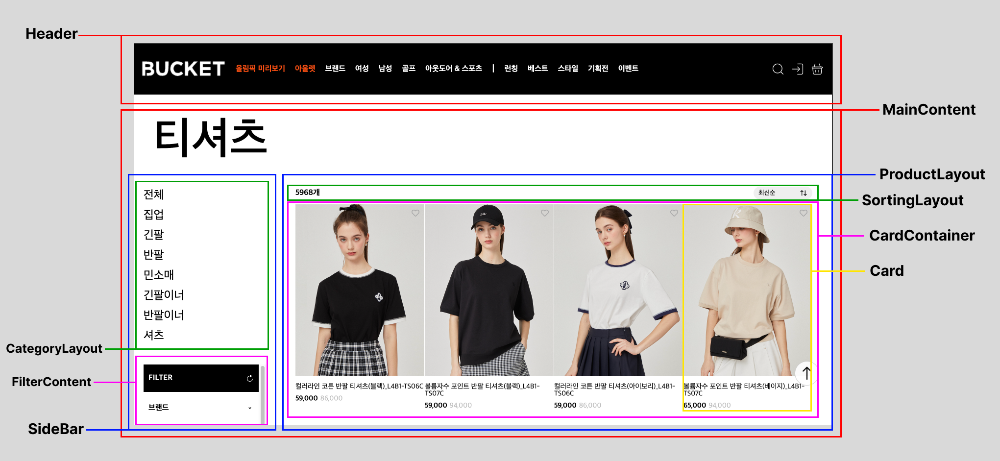
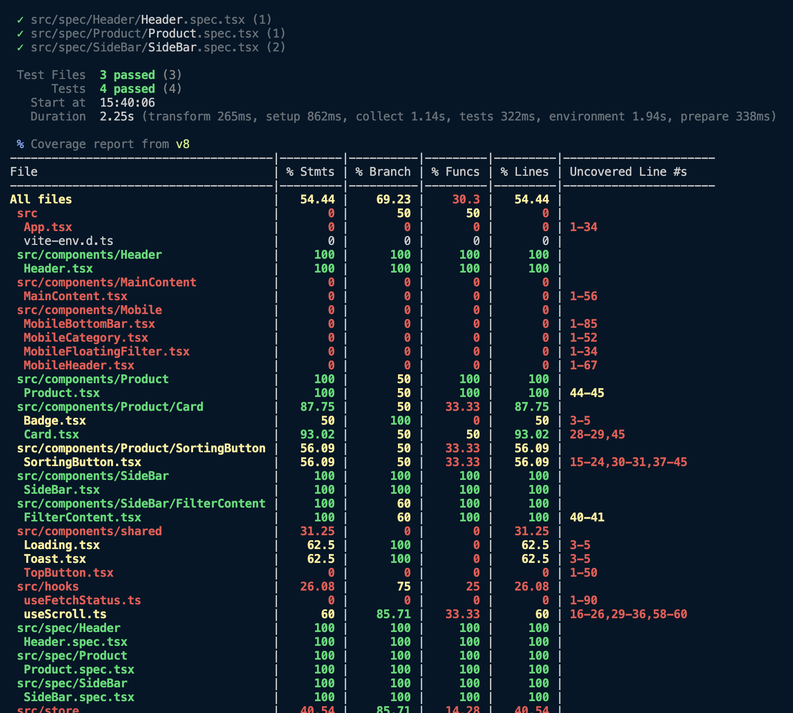
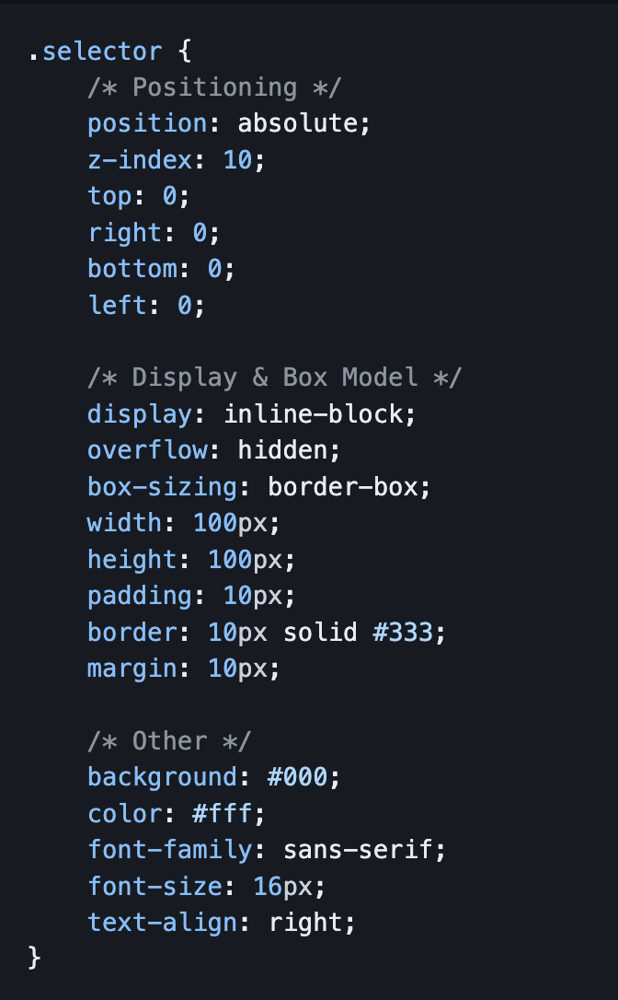

# BucketStore Frontend 과제_오성호

## 🧭 과제 개요
주어진 API를 활용하여 무한스크롤을 구현해야 합니다.

<br />

## ✅ 요구사항
- [X] 무한 스크롤
  - [X] 무한 스크롤 라이브러리 사용 금지
  - [X] 무한 스크롤 내부의 기능 구현을 위해서 외부 라이브러리 사용은 괜찮음
- [X] API로 데이터 수집
- [X] 표시 순서 변경
  - [X] 최신순
  - [X] 낮은 가격순
  - [X] 높은 가격순
  - [X] 할인률
  - [X] 베스트
- [X] 개별 상품 찜하기 / 해제
- [X] 상태관리 라이브러리 및 가상의 API로 상태변경을 처리하는 기능 구현
  - [X] Flow: 버튼 클릭 -> API갱신 -> 성공여부 확인 -> 상태 업데이트
<br />
<br />

## ❗️ 주의점
- 아무런 조치 없이 API연결 시도 시 `CORS`문제가 발생하게 됩니다.
  - `Express`등 간단한 프록시 서버를 만들어서 사용해 주세요.
- UI 구현요소
  - 적용형에 따른 페이지에 보여지는 UI는 모두 동일하게 구현해주세요
  - `1024px` / `1400px` / `1920px`를 기준으로 반응형으로 구현합니다
    - `≤ 1023px`: 2열 <br />
      1023px 이하에서는 플로팅 필터가 추가되는 것에 유의합니다
    - `≥ 1024px`: 4열
    - `1400px`: 상단 메뉴바 ui 변경
    - `1920px`: 최대 width이며 이 이상 값이 늘어나면 가운데 정렬 처리됩니다


<br />
<br />

## 🛜 API Endpoint
### 1. 상품 리스트 정보
  **GET `https://bucket-assignment-vercel.vercel.app/api`**
  ```js
  params: {
    length: number (12로 고정),
    type: string (newest [default] | low_price | high_price | high_discount_rate | best),
    category: number (25로 고정),
    page: number (1부터 시작)
  }
  ```
  <br />

### 2. ProxyServer API
  **GET `products/type/:type-string/page/:page-number`** <br />
  <br />

  `REST`규칙에 맞게끔 API를 설계하였습니다.
  1. **URI는 정보의 자원만을 표현하도록 설계했습니다.**
  2. **자원에 대한 행위는 HTTP Method(`GET`, `POST`, `PUT`, `DELETE`)로 표현하였습니다.**
  3. **밑줄(`_`)은 URI에 사용하지 않았습니다.** <br />
    밑줄은 보기 어렵거나 밑줄 때문에 문자가 가려지기도 합니다. 이런 문제를 피하기 위해 밑줄 대신 하이픈(`-`)을 사용하였습니다.
  4. **슬래시 구분자(`/`)는 계층 관계를 나타내는 데 사용했습니다.** <br />
    `type`이 `page`보다 상위 계층이라고 판단했습니다. <br />
      ex) 최신순의 1페이지, 낮은 가격순의 2페이지, ...

  <br />

  - **요청(Request)** <br />
    ```js
    const response = await fetch(
      `${SERVER_URI}/products/type/${typeString}/page/${pageNumber}`,
      {
        method: "GET",
      }
    );
    ```
    <br />

  - **응답(Reponse)** <br />
    | Status Code | Description |
    | --- | --- |
    | 200 | Success |
    | 400 | Bad Request |
    | 500 | Internal Server Error |

    - **성공시**
      ```js
      {
        "result": "Success",
        "status": 200
        "contents": [
          {
            code: 'CRS0000063509',
            name: '스트레치 슬리브 티셔츠(블랙)_L4A1-TS08C',
            statusCode: 'G008_90',
            brandName: 'LIKK',
            brandId: 961,
            price: {
              tag: 109000,
              real: 65000,
              discountRate: 40,
              maxDiscountPrice: 65000,
              maxDiscountRate: 40
            },
            url: 'https://cdn.bucketstore.com/goods/extmall//SC00072/CRS0000063509_01.jpeg',
            isFavorite: false,
            isSoldOut: false,
            deliveryFeeCode: 'SC00072_01',
            badges: null
          },
          // ...
        ]
      }
      ```

    - **오류 시**
      ```js
        {
          "status": "500",
          "message": "네트워크 통신이 원활하지 않습니다.",
        }
      ```

<br />

## 🎥 프리뷰
<image src="assets/README/first_rendering.gif" />
-> 첫 렌더링 시 <br />
<br />
<image src="assets/README/infinity_scroll.gif" />
-> 무한 스크롤 <br />
<br />
<image src="assets/README/category_change.gif" />
-> 표시 순서 변경(최신순, 낮은 가격순, 높은 가격순, 할인율, 베스트) <br />
<br />
<image src="assets/README/favorite.gif" />
-> 개별 상품 찜 및 해제 <br />
<br />
<image src="assets/README/responsive_ui.gif" />
-> 반응형 UI 구현 <br />
<br />
<br />

## 🏛️ 컴포넌트 구조


<br />

## ⚒️ 기술 스택
### FrontEnd
<div style="display:flex;">
  
  
  
  
</div>

### BackEnd
<div style="display:flex;">
  
  
</div>
<br />

- ### `styled-components`를 사용한 이유 <br />
  styled-components는 JavaScript의 변수나 함수, 조건문 등을 사용하여 동적으로 스타일을 생성할 수 있습니다. <br />
  이를 통해 다양한 상태에 따른 스타일 변경이 용이하기 때문에 Card컴포넌트를 동적으로 재사용하기에 유용하다고 판단되어 사용하게 되었습니다. <br />

- ### `zustand`를 사용한 이유 <br />
  코드의 `props-drilling`은 코드의 가독성을 저하시키며, 불필요한 리렌더링을 촉발할 수 있습니다. <br />
  전역상태 관리 라이브러리를 사용하여 `props-drilling`을 방지함과 동시에 성능을 최적화 시키기 위해서 사용했습니다. <br />
  zustand는 `Context API`를 사용하지 않고, 내부적으로 클로저를 이용하여 구현되어져 있으며 `pub-sub패턴`을 사용합니다. <br />
  또한 상태를 useRef를 통해서 관리하므로 리렌더링을 최소화 할 수 있다는 장점이 있습니다. <br />
  번들크기가 다른 전역상태 관리 라이브러리에 비해서 크기가 작으며, 보일러 플레이트가 간단해서 빠르게 적용할 수 있다는 장점이 있었습니다. <br />

- ### `express`를 사용한 이유
  BucketStore에서 제공하는 API를 브라우저에서 요청을 하게 되면 CORS 에러가 발생함에 따라 <br />
  프록시 서버를 통해 API를 요청해야 했습니다. <br />
  이에 따라서 최소한의 설정으로 간단하게 시작할 수 있는 프레임워크인 `express`를 사용하여 간단한 프록시 서버를 구현하였습니다.

<br />

## ⚙️ 실행 방법
- **저장소 클론**
```bash
// client
git clone https://github.com/tjd985/bucketstore_client.git

// server
git clone https://github.com/tjd985/bucketstore_server.git
```
<br />

- **종속성 설치**
```bash
npm install
```
<br />

- **프록시 서버 및 클라이언트 개발 서버 실행**
```bash
// 클라이언트, 서버 동일
npm run dev
```
<br />

- **테스트**
```bash
npm run test
```
<br />


## 🏔️ 기술적 챌린지
### 1. 무한 스크롤 구현
- `문제` <br />
  사용자의 스크롤이 하단에 가까워지고, 일정 포인트를 넘기면 다음 product를 가져와서 하단에 추가되도록 무한 스크롤을 구현해야 했습니다.
- `해결 방안` <br />
  전역객체인 window에 `scroll`이벤트가 발생할 때 마다 스크롤의 위치를 계산하는
  calculateEnd라는 이벤트 핸들러 함수를 구현하였고, <br />
  임계치를 `SCROLL_REQUEST_POINT (100px)`로 설정하여, 하단으로부터 100px 떨어진 지점을 스크롤이 지나게 되면 <br />
  `canRequest`상태를 `true`로 설정되도록 하였고, `canRequest`가 `true`라면 <br />
  다음 page의 product API를 불러오도록 구현하였습니다.
  ```ts
  function calculateEnd() {
    if (canRequest) {
      return;
    }

    if (
      window.innerHeight + window.scrollY + SCROLL_REQUEST_POINT >=
      document.body.offsetHeight
    ) {
      setCanRequest(true);
    }
  }

  // ... 중략

  useEffect(() => {
    if (canRequest) {
      increasePage();
      setCanRequest(false);
    }
  }, [canRequest]);
  ```
  <br />
  <br />

- `문제` <br />
  기존에 12개의 Card 컴포넌트가 렌더링 되어있는데, 무한 스크롤에 의해서 새로운 12개의 Card가 누적되어 24개의 Card를 렌더링 해주는 과정중<br />
  기존에 렌더링 되있던 12개의 Card는 변경사항이 없는데도, 리렌더링이 발생하는 문제가 있었습니다.
  <br />
- `해결 방안` <br />
  변경사항이 없는 Card 컴포넌트는 리렌더링이 발생할 필요가 없었기에<br />
  `React.memo`를 활용하여 Card 컴포넌트를 `memoization` 해주었습니다. <br />
  이에 따라서 새로 추가되는 Card만 새롭게 렌더링이 되었고, <br />
  기존에 렌더링 되있던 Card들은 불필요한 리렌더링을 막아줄 수 있었습니다. <br />
  ```ts
  import { useState, memo } from "react";

  function Card({
    imagePath,
    name,
    tagPrice,
    sellPrice,
    badgeNameList,
  }: CardParams) {
    // ... 중략
    return (
      <CardWrapper>
        <FavoriteSection
          onClick={() => {
            setIsFavorite(!isFavorite);
          }}
        >
      // ... 중략
      </CardWrapper>
    );
  }

  export default memo(Card);
  ```
  <br />
  <br />

- `문제` <br />
  scroll 이벤트가 자주 발생함에 따라서 스크롤이 임계치를 지난 이후에 발생하는 모든 스크롤 이벤트만큼 API요청 이루어지는 `중복 API 요청` 문제가 발생하였습니다. <br />
- `해결 방안` <br />
  lodash에서 제공하는 `throttle` 메서드를 활용하였습니다. <br />
  `throttle`을 사용하여 지정된 시간(`THROTTLE_TIME`, `1000ms`) 간격마다 이벤트를 처리하도록 즉, 일정 시간 내에 여러 번 이벤트가 발생해도 한 번만 실행되도록 처리 하여 <br />
  무수히 많은 스크롤 이벤트를 제어하여 성능을 최적화 함으로써 중복 요청을 제거했습니다.
  ```ts
  import { throttle } from "lodash";
  import { SCROLL_REQUEST_POINT, THROTTLE_TIME } from "../constants/constants.ts";

  useEffect(() => {
    const throttledCaclulateEnd = throttle(calculateEnd, THROTTLE_TIME);

    window.addEventListener("scroll", throttledCaclulateEnd);

    return () => {
      window.removeEventListener("scroll", throttledCaclulateEnd);
    };
  }, []);
  ```
  <br />
  <br />

### 2. 컴포넌트의 뷰 로직과 비즈니스 로직 분리
- `문제` <br />
  컴포넌트 내에서 데이터 요청과 UI 렌더링 로직이 혼재되어 있으면, 코드가 복잡해지고 유지보수가 어려워지는 문제가 발생했습니다.<br />

- `해결 방안` <br />
  모든 product 데이터를 가져오는 네트워크 요청 로직을 `useProductStatus` 커스텀 훅으로 분리하여 구현했고, <br />
  스크롤이 아래로 스크롤 되었는지, 위로 스크롤 되었는지를 판별하는 로직을 <br />
  `useScroll` 커스텀 훅으로 분리하여 구현했습니다.
  해당 커스텀 훅을 사용하여 컴포넌트의 뷰 로직과 비즈니스 로직을 분리하여 추상화 시켰고, <br />
  이를 통해서 컴포넌트는 데이터를 가져오는 방법에 대한 세부 사항을 알 필요가 없어서 뷰 로직에만 집중 할 수 있게 하였습니다. <br />
  관심사의 분리를 통해서 데이터 요청 관련 로직의 유지보수성이 향상되었고, 코드의 가독성 또한 향상시킬 수 있었습니다.
<br />
<br />

### 3. 반응형 UI에서 스크롤에 따른 헤더와 하단 메뉴 바 숨기기
- `문제` <br />
  스크롤이 아래로 향하는지, 위로 향하는지에 따라서 `≤ 1023px` 환경에서는 <br />
  - `아래로 스크롤`: 헤더, 하단 메뉴 바가 숨겨져야 합니다.
  - `위로 스크롤`: 헤더, 하단 메뉴 바가 나타나야 합니다.

- `해결 방안` <br />
  스크롤 이벤트가 발생할 때마다 해당 스크롤 값을 `beforeScroll`이라는 상태로 설정해준 뒤, <br />
  다음 스크롤 이벤트가 발생하면 beforeScroll값과 이벤트가 발생한 시점의 스크롤 값을 비교하여 <br />
  값이 증가하였다면 아래로 스크롤, 값이 감소하였다면 위로 스크롤 이라고 설정하여 <br />
  스크롤 상태를 `UP`과 `DOWN`으로 구분하여 전역상태로 관리하였습니다.
  또한 헤더와, 하단 메뉴바는 해당 스크롤 상태에 따라서 `className`을 다르게 설정해 주었고, <br />
  `className`에 따라서 스타일이 각각 다르게 적용되게 함으로써 구현할 수 있었습니다.
  ```ts
  // useScroll 커스텀 훅
  import useScrollStore from "../store/scroll.ts";

  const { setScrollDirection } = useScrollStore();

  function getScrollDirection() {
    if (beforeScroll < window.scrollY) {
      setScrollDirection("DOWN");
    } else {
      setScrollDirection("UP");
    }

    setBeforeScroll(window.scrollY);
  }
  ```
  ```ts
  // 컴포넌트
  function MobileBottomBar() {
  const { scroll } = useScrollStore();

  return (
    <MobileBottomLayout className={scroll === "UP" ? "SHOW" : "HIDE"}>
      {BottomBarButtons.map(({ icon, label }) => {
        return (
          <BarItem key={label}>
            {icon}
            <h1 className="item_title">{label}</h1>
          </BarItem>
        );
      })}
      <MobileFloatingFilter />
    </MobileBottomLayout>
  );
  ```
<br />
<br />

## 🧪 단위 테스트 작성
`vitest`를 활용하여 클라이언트 측에서 컴포넌트 단위로, <br />
렌더링이 정상적으로 이루어 지는지 간단한 단위 테스트를 작성하였습니다.


<br />

## 📝 코드 및 커밋 컨벤션
### JS
<a href="https://github.com/airbnb/javascript">airbnb js style guide</a>의 JS스타일 가이드를 따랐습니다. <br />
이를 위해서 `eslint`또한 airbnb 스타일 가이드를 준수하도록 설정해주었습니다.

### CSS
<a href="https://github.com/necolas/idiomatic-css">Principles of writing consistent, idiomatic CSS</a>의 스타일 가이드를 따랐습니다.


### Commit
| 커밋 유형 | 의미 |
| --- | --- |
| ✨[Feat] | 새로운 기능 추가 |
| 🐛 [Fix] | 버그 수정 |
| 📝[Docs] | 문서 수정 |
| ✏️[Style] | 코드 formatting, 세미콜론 누락, 코드 자체의 변경이 없는 경우 |
| ♻️[Refactor] | 코드 리팩토링 |
| ✅[Test] | 테스트 코드, 리팩토링 테스트 코드 추가 |
| 📦[Chore] | 패키지 매니저 수정, 그 외 기타 수정 ex) .gitignore |
| 💄[Design] | CSS 등 사용자 UI 디자인 변경 |
| 💬[Comment] | 필요한 주석 추가 및 변경 |
| 🚚[Rename] | 파일 또는 폴더 명을 수정하거나 옮기는 작업만인 경우 |
| 🔥[Remove] | 파일을 삭제하는 작업만 수행한 경우 |
| 🔨!BREAKING CHANGE | 커다란 API 변경의 경우 |
| 🐛🚑 !HOTFIX | 급하게 치명적인 버그를 고쳐야 하는 경우 |
| 🏷️ [Type] | 타입을 추가•삭제 및 수정하는 경우 |

<br />

## 🤔 느낀점
프로젝트를 수행하면서 다양한 기술적 챌린지를 해결하고, 과정에서 많은 성장을 이룰 수 있었습니다. <br />
특히, 이벤트와 리렌더링 최적화를 위한 `throttle`, `memo` 과 같은 경험을<br />
이번 프로젝트를 통해서 다시금 복습해볼 수 있는 소중한 기회였습니다. <br />
이번 과제를 통해 정말 많은 것을 배울 수 있었고, 이런 기회를 주셔서 진심으로 감사드립니다. <br />
앞으로도 더욱 발전하는 개발자가 되겠습니다. 😊 <br />
감사합니다.